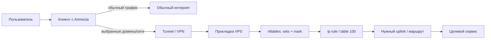
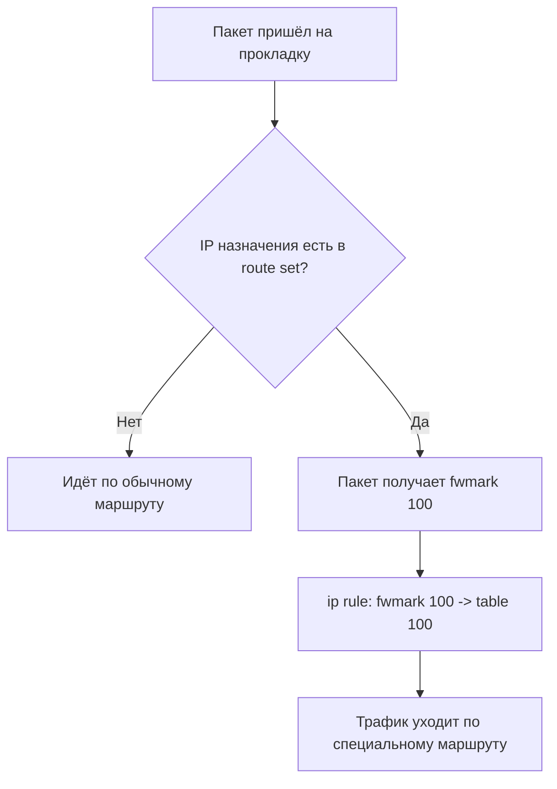

# Amnezia + прокладка + selective routing

Полная документация по схеме клиента, прокладки и выборочной маршрутизации доменов/сетей через VPN.

Версия документа: 2026-04-20

---

## 1. Что это за схема

Цель схемы — сделать так, чтобы:

- основной интернет у клиента работал как обычно;
- только нужные сайты и сервисы шли через VPN;
- в роли VPN-сервера использовалась **прокладка**;
- на прокладке можно было вручную управлять:
  - доменами для резолва в IP и последующего роутинга;
  - файлами с IP/CIDR-подсетями;
  - nftables-наборами, через которые этот трафик маркируется и уходит в нужную таблицу маршрутизации.

Документ написан так, чтобы:

- через долгое время можно было поднять всё заново на чистом сервере;
- было понятно даже без глубокого опыта в Linux и сетях;
- его можно было положить в GitHub как README / docs page.

---

## 2. Термины простыми словами

### Клиент

Это твой компьютер, телефон или другое устройство, где установлен клиент Amnezia.

### Прокладка

Это внешний VPS-сервер, который принимает VPN-подключение от клиента.

### Маршрутизация / routing

Правило, которое говорит системе: _куда отправлять трафик к определённому адресу_.

### Selective routing

Это выборочная маршрутизация: не весь трафик через VPN, а только к нужным доменам или IP.

### nftables

Это встроенный в Linux механизм правил для фильтрации, маркировки и обработки трафика.

### IP set / nft set

Это набор IP-адресов или подсетей, к которым можно применять одно и то же правило.

---

## 3. Общая схема прохождения трафика

## 3.1 Логика на пальцах

1. Пользователь на клиенте открывает сайт.
2. Клиент смотрит: этот домен/сеть должен идти через VPN или нет.
3. Если да — трафик идёт в туннель Amnezia.
4. Трафик приходит на **прокладку**.
5. На прокладке nftables помечает нужные пакеты специальной меткой.
6. По этой метке Linux policy routing отправляет этот трафик в нужную таблицу маршрутов.
7. Дальше пакет уходит через нужный интерфейс/туннель согласно настройке прокладки.

---

## 3.2 Схема в виде Mermaid



---

## 3.3 Схема принятия решения на прокладке



---

## 4. Какие машины участвуют

Минимально участвуют две стороны:

### Машина 1 — клиент

На клиенте должен быть:

- установлен **Amnezia client**;
- импортирован профиль подключения к серверу-прокладке;
- настроен selective routing со стороны клиента, если это требуется по твоей схеме.

### Машина 2 — прокладка (VPS)

На сервере-прокладке должны быть:

- Linux-сервер;
- Docker;
- контейнер Amnezia/Xray или другой реально используемый транспорт;
- WireGuard / AmneziaWG, если он участвует в схеме;
- nftables;
- policy routing (`ip rule`, `ip route`);
- служебные скрипты для обновления route set'ов.

---

## 5. Итоговая архитектура на прокладке

На прокладке у тебя используется такая логика:

1. Есть nftables-таблица `inet amzroute`.
2. В ней есть наборы адресов для ручной маршрутизации:
   - `de_manual4`
   - `de_manual6`
3. Есть наборы адресов, полученных резолвом доменов:
   - `de_domains4`
   - `de_domains6`
4. В цепочках `output` и `prerouting` трафик к адресам из этих наборов получает `mark 100` (`0x64`).
5. По правилу `ip rule` пакеты с этой меткой уходят в отдельную таблицу маршрутизации.

Это и есть сердце схемы.

---

## 6. Что должно быть установлено

## 6.1 На прокладке

Обязательный минимум:

- Ubuntu / Debian-like Linux
- `nftables`
- `iproute2`
- `docker`
- `dnsmasq` — если используется отдельная схема доменного роутинга через dnsmasq
- `curl`, `awk`, `sed`, `grep`, `sort`, `getent`

Пример установки:

```bash
sudo apt update
sudo apt install -y nftables iproute2 dnsmasq curl gawk sed grep coreutils
sudo apt install -y docker.io
```

Включение сервисов:

```bash
sudo systemctl enable nftables
sudo systemctl enable docker
```

---

## 6.2 На клиенте

Должно быть:

- приложение Amnezia;
- рабочий профиль подключения к прокладке;
- понимание, какие домены/сети должны идти через VPN.

---

## 7. Какие порты используются

После зачистки на прокладке у тебя остались только нужные публичные TCP-порты:

- `22/tcp` — SSH
- `443/tcp` — Xray / вход для клиента

Локальные служебные порты на `127.0.0.1`:

- `53/tcp`, `53/udp` — dnsmasq / systemd-resolved
- служебный `containerd` loopback-порт

Это хороший итог: наружу торчат только реально нужные сервисы.

---

## 8. Структура файлов на прокладке

Рекомендуемая структура:

```text
/etc/amzroute/
├── domains.list              # список доменов для ручного резолва
├── ipfiles.list              # список файлов с IP/CIDR
└── ipsets/
    ├── googlevideo.txt
    ├── openai-extra.txt
    └── custom.txt

/etc/nftables.conf            # основной конфиг nftables
/etc/nftables.d/
├── 10-amzroute-base.nft      # базовая таблица/цепочки/set'ы
└── 11-manual-generated.nft   # сгенерированные элементы sets

/usr/local/sbin/
├── amnezia-route-refresh-domains
├── amnezia-route-refresh-ipfiles
├── amnezia-route-add-domain
└── amnezia-route-add-ipfile
```

---

## 9. Как устроен routing на прокладке

## 9.1 nftables sets

Используются 4 основных ручных набора:

- `de_manual4` — IPv4 из IP-файлов
- `de_manual6` — IPv6 из IP-файлов
- `de_domains4` — IPv4, полученные резолвом доменов
- `de_domains6` — IPv6, полученные резолвом доменов

## 9.2 Маркировка

Если пакет идёт к IP, который есть в одном из наборов, ему ставится:

```text
fwmark 100 (0x64)
```

## 9.3 Policy routing

Дальше правило вида:

```bash
ip rule add fwmark 100 table 100
```

говорит системе:

> все пакеты с меткой 100 отправляй не по обычной таблице, а по таблице 100.

А в таблице 100 уже лежит специальный маршрут.

---

## 10. Базовый nftables-конфиг

Ниже пример понятной базовой структуры.

```nft
#!/usr/sbin/nft -f
flush ruleset

include "/etc/nftables.d/*.nft"
```

Пример `/etc/nftables.d/10-amzroute-base.nft`:

```nft
table inet amzroute {
    set de_manual4 {
        type ipv4_addr
        flags interval
    }

    set de_manual6 {
        type ipv6_addr
        flags interval
    }

    set de_domains4 {
        type ipv4_addr
        flags interval
    }

    set de_domains6 {
        type ipv6_addr
        flags interval
    }

    chain output {
        type route hook output priority mangle; policy accept;
        ip daddr @de_manual4 meta mark set 0x00000064
        ip6 daddr @de_manual6 meta mark set 0x00000064
        ip daddr @de_domains4 meta mark set 0x00000064
        ip6 daddr @de_domains6 meta mark set 0x00000064
    }

    chain prerouting {
        type filter hook prerouting priority mangle; policy accept;
        ip daddr @de_manual4 meta mark set 0x00000064
        ip6 daddr @de_manual6 meta mark set 0x00000064
        ip daddr @de_domains4 meta mark set 0x00000064
        ip6 daddr @de_domains6 meta mark set 0x00000064
    }
}
```

Проверка и применение:

```bash
sudo nft -c -f /etc/nftables.conf
sudo nft -f /etc/nftables.conf
```

---

## 11. Домены: как это работает

Домены не кладутся в отдельные файлы по одному домену.

Они хранятся в одном списке:

```text
/etc/amzroute/domains.list
```

Пример содержимого:

```text
chatgpt.com
openai.com
oaistatic.com
oaiusercontent.com
```

После этого утилита:

```bash
sudo amnezia-route-refresh-domains
```

делает следующее:

1. читает список доменов;
2. резолвит их в IPv4/IPv6;
3. убирает дубли;
4. генерирует nft-элементы;
5. обновляет `de_domains4` и `de_domains6`.

---

## 12. IP-файлы: как это работает

IP и подсети можно держать в нескольких отдельных файлах.

Сами файлы могут лежать где угодно, но удобно хранить их в:

```text
/etc/amzroute/ipsets/
```

Каждый файл — это просто список IP или CIDR по одному на строку.

Пример `googlevideo.txt`:

```text
8.6.112.6
8.47.69.6
172.217.0.0/16
142.250.0.0/15
```

Подключение файла в систему:

```bash
sudo amnezia-route-add-ipfile /etc/amzroute/ipsets/googlevideo.txt
sudo amnezia-route-refresh-ipfiles
```

После этого:

- путь к файлу записывается в `/etc/amzroute/ipfiles.list`;
- все IP/CIDR из всех файлов собираются вместе;
- дубли убираются;
- валидные IPv4 попадают в `de_manual4`;
- валидные IPv6 попадают в `de_manual6`.

---

## 13. Нужные утилиты

Ниже описаны утилиты, которые должны быть в системе.

---

## 13.1 `amnezia-route-add-domain`

### Что делает

Добавляет домен в `/etc/amzroute/domains.list`, если его там ещё нет.

### Пример

```bash
sudo amnezia-route-add-domain chatgpt.com
sudo amnezia-route-add-domain openai.com
```

### Ожидаемое поведение

- приводит домен к нижнему регистру;
- убирает дубли;
- не ломает файл, если домен уже есть.

---

## 13.2 `amnezia-route-refresh-domains`

### Что делает

Читает `/etc/amzroute/domains.list`, резолвит домены и обновляет nft sets `de_domains4`/`de_domains6`.

### Пример

```bash
sudo amnezia-route-refresh-domains
```

### Полезно после

- добавления нового домена;
- удаления домена;
- смены CDN/IP у сервиса.

---

## 13.3 `amnezia-route-add-ipfile`

### Что делает

Добавляет путь к файлу с IP/CIDR в список `/etc/amzroute/ipfiles.list`.

### Пример

```bash
sudo amnezia-route-add-ipfile /etc/amzroute/ipsets/googlevideo.txt
```

Если файла не существует — утилита должна ругнуться и ничего не добавлять.

---

## 13.4 `amnezia-route-refresh-ipfiles`

### Что делает

Собирает все IP/CIDR из файлов, перечисленных в `/etc/amzroute/ipfiles.list`, чистит дубли и обновляет nft sets `de_manual4` / `de_manual6`.

### Пример

```bash
sudo amnezia-route-refresh-ipfiles
```

---

## 14. Примеры типовых операций

## 14.1 Добавить новый домен

```bash
sudo amnezia-route-add-domain example.com
sudo amnezia-route-refresh-domains
```

## 14.2 Посмотреть список доменов

```bash
cat /etc/amzroute/domains.list
```

## 14.3 Добавить новый IP-файл

```bash
sudo nano /etc/amzroute/ipsets/myservice.txt
sudo amnezia-route-add-ipfile /etc/amzroute/ipsets/myservice.txt
sudo amnezia-route-refresh-ipfiles
```

## 14.4 Посмотреть список файлов с IP

```bash
cat /etc/amzroute/ipfiles.list
```

## 14.5 Проверить содержимое nft set

```bash
sudo nft list set inet amzroute de_domains4
sudo nft list set inet amzroute de_domains6
sudo nft list set inet amzroute de_manual4
sudo nft list set inet amzroute de_manual6
```

## 14.6 Проверить весь ruleset

```bash
sudo nft list ruleset
```

---

## 15. Как поднимать всё с нуля на чистом сервере

Ниже последовательность без привязки к старым данным.

### Шаг 1. Подготовить сервер

- установить Ubuntu/Debian;
- настроить SSH-доступ;
- обновить пакеты.

```bash
sudo apt update && sudo apt upgrade -y
```

### Шаг 2. Установить пакеты

```bash
sudo apt install -y nftables iproute2 dnsmasq docker.io curl gawk
sudo systemctl enable nftables docker
```

### Шаг 3. Развернуть прокладку / контейнер Amnezia/Xray

Минимально нужен рабочий контейнер, который слушает `443/tcp`.

Проверка:

```bash
docker ps --format 'table {{.Names}}\t{{.Ports}}'
sudo ss -lntup
```

### Шаг 4. Создать структуру каталогов

```bash
sudo mkdir -p /etc/amzroute/ipsets
sudo mkdir -p /etc/nftables.d
```

### Шаг 5. Положить базовый nftables-конфиг

Создать:

- `/etc/nftables.conf`
- `/etc/nftables.d/10-amzroute-base.nft`

Проверить и применить:

```bash
sudo nft -c -f /etc/nftables.conf
sudo nft -f /etc/nftables.conf
```

### Шаг 6. Настроить policy routing

Нужны:

- `ip rule` для fwmark `100`;
- маршрут в таблице `100`.

Проверка:

```bash
ip rule show
ip route show table 100
```

### Шаг 7. Развернуть утилиты

Положить в `/usr/local/sbin/`:

- `amnezia-route-add-domain`
- `amnezia-route-refresh-domains`
- `amnezia-route-add-ipfile`
- `amnezia-route-refresh-ipfiles`

Сделать исполняемыми:

```bash
sudo chmod +x /usr/local/sbin/amnezia-route-*
```

### Шаг 8. Создать списки

```bash
sudo touch /etc/amzroute/domains.list
sudo touch /etc/amzroute/ipfiles.list
```

### Шаг 9. Добавить нужные домены

```bash
sudo amnezia-route-add-domain chatgpt.com
sudo amnezia-route-add-domain openai.com
sudo amnezia-route-add-domain oaistatic.com
sudo amnezia-route-add-domain oaiusercontent.com
sudo amnezia-route-refresh-domains
```

### Шаг 10. Добавить IP-файлы

```bash
sudo amnezia-route-add-ipfile /etc/amzroute/ipsets/googlevideo.txt
sudo amnezia-route-refresh-ipfiles
```

### Шаг 11. Проверить результат

```bash
sudo nft list set inet amzroute de_domains4
sudo nft list set inet amzroute de_manual4
sudo nft list ruleset
```

---

## 16. Как понять, что всё работает

### Проверка 1. Порты наружу

С внешней машины:

```bash
nc -vz <IP_ПРОКЛАДКИ> 22
nc -vz <IP_ПРОКЛАДКИ> 443
```

Ожидаемо:

- 22 — открыт
- 443 — открыт

### Проверка 2. Лишние порты закрыты

С внешней машины:

```bash
nc -vz <IP_ПРОКЛАДКИ> 34144
```

Если порт больше не используется, он не должен быть доступен.

### Проверка 3. nft sets заполнены

```bash
sudo nft list set inet amzroute de_domains4
sudo nft list set inet amzroute de_domains6
```

### Проверка 4. Домены реально резолвятся

```bash
getent ahostsv4 chatgpt.com
getent ahostsv4 openai.com
```

### Проверка 5. Трафик реально идёт через прокладку

Можно смотреть tcpdump на нужном интерфейсе и контейнерный IP-источник.

---

## 17. Почему автообновление доменов было отключено

В твоей схеме автообновление оказалось нестабильным: после очередного обновления доменных IP трафик через прокладку начинал вести себя хуже.

Поэтому принято решение:

- **не использовать автоматический systemd timer**;
- обновлять доменные наборы **вручную**, когда это действительно нужно.

Это даёт:

- предсказуемость;
- меньше внезапных изменений;
- проще диагностику.

---

## 18. Что важно не забыть

### 18.1 Бэкапы

Перед изменениями полезно сохранять:

- `/etc/nftables.conf`
- `/etc/nftables.d/`
- `/etc/amzroute/`
- конфиги контейнера / Amnezia / Xray

Пример:

```bash
sudo tar -czf ~/amzroute-backup-$(date +%F_%H-%M-%S).tar.gz \
  /etc/nftables.conf \
  /etc/nftables.d \
  /etc/amzroute
```

### 18.2 Комментарии в файлах

Каждый IP-файл стоит снабжать комментарием, что это за сервис.

Пример:

```text
# Googlevideo / YouTube CDN
8.6.112.6
8.47.69.6
```

### 18.3 Не смешивать домены и IP в одном файле

Лучше так:

- домены — только в `domains.list`
- IP/CIDR — только в `ipsets/*.txt`

Так проще отлаживать.

### 18.4 Проверять конфиг до применения

Всегда:

```bash
sudo nft -c -f /etc/nftables.conf
```

И только потом:

```bash
sudo nft -f /etc/nftables.conf
```

---

## 19. Рекомендуемые улучшения документации и проекта

Ниже пункты, которые полезно добавить в GitHub-репозиторий, даже если ты их отдельно не просил.

### 19.1 `README.md`

Короткий входной файл:

- что делает проект;
- как быстро поднять;
- где смотреть полную документацию.

### 19.2 `docs/architecture.md`

Подробная архитектура — можно использовать этот документ как основу.

### 19.3 `docs/troubleshooting.md`

Отдельный раздел с типовыми проблемами:

- домен добавлен, но трафик не идёт;
- nft set пустой;
- порт снаружи всё ещё открыт;
- `ip rule` есть, а маршрут не работает.

### 19.4 `scripts/`

Хранить все утилиты в репозитории:

- `amnezia-route-add-domain`
- `amnezia-route-refresh-domains`
- `amnezia-route-add-ipfile`
- `amnezia-route-refresh-ipfiles`

### 19.5 `examples/`

Примеры готовых файлов:

- `examples/domains.list`
- `examples/googlevideo.txt`
- `examples/openai.txt`

Это очень упрощает повторное развёртывание.

---

## 20. Минимальный cheat sheet

### Добавить домен

```bash
sudo amnezia-route-add-domain openai.com
sudo amnezia-route-refresh-domains
```

### Добавить файл IP

```bash
sudo amnezia-route-add-ipfile /etc/amzroute/ipsets/googlevideo.txt
sudo amnezia-route-refresh-ipfiles
```

### Проверить nftables

```bash
sudo nft list ruleset
```

### Проверить конкретный set

```bash
sudo nft list set inet amzroute de_domains4
sudo nft list set inet amzroute de_manual4
```

### Проверить слушающие порты

```bash
sudo ss -lntup
```

### Проверить снаружи

```bash
nc -vz <IP_ПРОКЛАДКИ> 22
nc -vz <IP_ПРОКЛАДКИ> 443
```

---

## 21. Итог

На текущем этапе у тебя зафиксирована рабочая модель:

- прокладка принимает соединения клиента;
- наружу оставлены только нужные порты;
- домены OpenAI добавляются вручную и обновляются вручную;
- IP/CIDR можно держать в нескольких отдельных файлах;
- nftables использует отдельные sets для доменов и IP-файлов;
- схема пригодна для ручного сопровождения без нестабильного автообновления.

Это уже не набор разрозненных команд, а воспроизводимая инфраструктурная схема.

---

## 22. Что ещё стоит приложить в репозиторий

Рекомендуемый набор файлов для GitHub:

```text
README.md
docs/
  architecture.md
  troubleshooting.md
scripts/
  amnezia-route-add-domain
  amnezia-route-refresh-domains
  amnezia-route-add-ipfile
  amnezia-route-refresh-ipfiles
examples/
  domains.list
  googlevideo.txt
  openai.txt
```

Если делать красиво для GitHub, этот файл лучше использовать как:

- `docs/architecture.md`,
- а в `README.md` дать короткое описание и ссылки на разделы.

