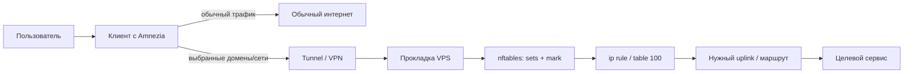
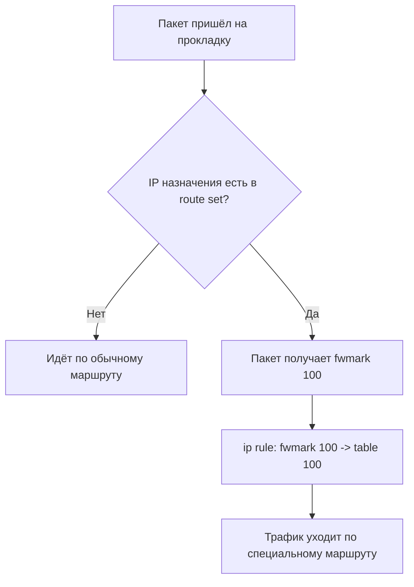

# Amnezia + прокладка + selective routing

Полная документация по схеме клиента, прокладки и выборочной маршрутизации доменов/сетей через VPN.

Версия документа: 2026-04-20

---

## 1. Что это за схема

Цель схемы — сделать так, чтобы:

- основной интернет у клиента работал как обычно;
- только нужные сайты и сервисы шли через VPN;
- в роли VPN-сервера использовалась **прокладка**;
- на прокладке можно было вручную управлять:
  - доменами для резолва в IP и последующего роутинга;
  - файлами с IP/CIDR-подсетями;
  - nftables-наборами, через которые этот трафик маркируется и уходит в нужную таблицу маршрутизации.

Документ написан так, чтобы:

- через долгое время можно было поднять всё заново на чистом сервере;
- было понятно даже без глубокого опыта в Linux и сетях;
- его можно было положить в GitHub как README / docs page.

---

## 2. Термины простыми словами

### Клиент

Это твой компьютер, телефон или другое устройство, где установлен клиент Amnezia.

### Прокладка

Это внешний VPS-сервер, который принимает VPN-подключение от клиента.

### Маршрутизация / routing

Правило, которое говорит системе: _куда отправлять трафик к определённому адресу_.

### Selective routing

Это выборочная маршрутизация: не весь трафик через VPN, а только к нужным доменам или IP.

### nftables

Это встроенный в Linux механизм правил для фильтрации, маркировки и обработки трафика.

### IP set / nft set

Это набор IP-адресов или подсетей, к которым можно применять одно и то же правило.

---

## 3. Общая схема прохождения трафика

### 3.1 Логика на пальцах

1. Пользователь на клиенте открывает сайт.
2. Клиент смотрит: этот домен/сеть должен идти через VPN или нет.
3. Если да — трафик идёт в туннель Amnezia.
4. Трафик приходит на **прокладку**.
5. На прокладке nftables помечает нужные пакеты специальной меткой.
6. По этой метке Linux policy routing отправляет этот трафик в нужную таблицу маршрутов.
7. Дальше пакет уходит через нужный интерфейс/туннель согласно настройке прокладки.

### 3.2 Схема в виде Mermaid



### 3.3 Схема принятия решения на прокладке



---

## 4. Какие машины участвуют

Минимально участвуют две стороны.

### Машина 1 — клиент

На клиенте должен быть:

- установлен **Amnezia client**;
- импортирован профиль подключения к серверу-прокладке;
- настроен selective routing со стороны клиента, если это требуется по твоей схеме.

### Машина 2 — прокладка (VPS)

На сервере-прокладке должны быть:

- Linux-сервер;
- Docker;
- контейнер Amnezia/Xray или другой реально используемый транспорт;
- WireGuard / AmneziaWG, если он участвует в схеме;
- nftables;
- policy routing (`ip rule`, `ip route`);
- служебные скрипты для обновления route set'ов.

---

## 5. Итоговая архитектура на прокладке

На прокладке используется такая логика:

1. Есть nftables-таблица `inet amzroute`.
2. В ней есть наборы адресов для ручной маршрутизации:
   - `de_manual4`
   - `de_manual6`
3. Есть наборы адресов, полученных резолвом доменов:
   - `de_domains4`
   - `de_domains6`
4. В цепочках `output` и `prerouting` трафик к адресам из этих наборов получает `mark 100` (`0x64`).
5. По правилу `ip rule` пакеты с этой меткой уходят в отдельную таблицу маршрутизации.

Это и есть сердце схемы.

---

## 6. Что должно быть установлено

### 6.1 На прокладке

Обязательный минимум:

- Ubuntu / Debian-like Linux
- `nftables`
- `iproute2`
- `docker`
- `dnsmasq` — если используется отдельная схема доменного роутинга через dnsmasq
- `curl`, `awk`, `sed`, `grep`, `sort`, `getent`

Пример установки:

```bash
sudo apt update
sudo apt install -y nftables iproute2 dnsmasq curl gawk sed grep coreutils
sudo apt install -y docker.io
```

Включение сервисов:

```bash
sudo systemctl enable nftables
sudo systemctl enable docker
```

### 6.2 На клиенте

Должно быть:

- приложение Amnezia;
- рабочий профиль подключения к прокладке;
- понимание, какие домены/сети должны идти через VPN.

---

## 7. Какие порты используются

После зачистки на прокладке у тебя остались только нужные публичные TCP-порты:

- `22/tcp` — SSH
- `443/tcp` — Xray / вход для клиента

Локальные служебные порты на `127.0.0.1`:

- `53/tcp`, `53/udp` — dnsmasq / systemd-resolved
- служебный `containerd` loopback-порт

---

## 8. Структура файлов на прокладке

Рекомендуемая структура:

```text
/etc/amzroute/
├── domains.list              # список доменов для ручного резолва
├── ipfiles.list              # список файлов с IP/CIDR
└── ipsets/
    ├── googlevideo.txt
    ├── openai-extra.txt
    └── custom.txt

/etc/nftables.conf            # основной конфиг nftables
/etc/nftables.d/
├── 10-amzroute-base.nft      # базовая таблица/цепочки/set'ы
└── 11-manual-generated.nft   # сгенерированные элементы sets

/usr/local/sbin/
├── amnezia-route-refresh-domains
├── amnezia-route-refresh-ipfiles
├── amnezia-route-apply
├── amnezia-route-add-domain
└── amnezia-route-add-ipfile
```

---

## 9. Что уже отключено и почему

Ранее использовалось автообновление доменов через systemd timer/service:

- `amzroute-domains-update.timer`
- `amzroute-domains-update.service`
- `/usr/local/bin/update-amzroute-domains.sh`

Они **отключены и удалены**, потому что периодическое автообновление иногда ломало стабильность трафика через прокладку.

Теперь логика такая:

- домены добавляются вручную;
- резолв и обновление route set'ов запускаются вручную;
- применение новой политики роутинга тоже делается вручную.

Это более предсказуемо и безопасно.

---

## 10. Базовый nftables-конфиг

### 10.1 `/etc/nftables.conf`

```nft
#!/usr/sbin/nft -f
flush ruleset

include "/etc/nftables.d/*.nft"
```

### 10.2 `/etc/nftables.d/10-amzroute-base.nft`

```nft
table inet amzroute {
    set de_dst4 {
        type ipv4_addr
        flags interval
    }

    set de_dst6 {
        type ipv6_addr
        flags interval
    }

    set de_manual4 {
        type ipv4_addr
        flags interval
    }

    set de_manual6 {
        type ipv6_addr
        flags interval
    }

    set de_domains4 {
        type ipv4_addr
        flags interval
    }

    set de_domains6 {
        type ipv6_addr
        flags interval
    }

    chain output {
        type route hook output priority mangle; policy accept;
        ip daddr @de_dst4 meta mark set 0x00000064
        ip daddr @de_manual4 meta mark set 0x00000064
        ip daddr @de_domains4 meta mark set 0x00000064

        ip6 daddr @de_dst6 meta mark set 0x00000064
        ip6 daddr @de_manual6 meta mark set 0x00000064
        ip6 daddr @de_domains6 meta mark set 0x00000064
    }

    chain prerouting {
        type filter hook prerouting priority mangle; policy accept;
        ip daddr @de_dst4 meta mark set 0x00000064
        ip daddr @de_manual4 meta mark set 0x00000064
        ip daddr @de_domains4 meta mark set 0x00000064

        ip6 daddr @de_dst6 meta mark set 0x00000064
        ip6 daddr @de_manual6 meta mark set 0x00000064
        ip6 daddr @de_domains6 meta mark set 0x00000064
    }
}
```

---

## 11. Генерируемый файл с наборами

### 11.1 `/etc/nftables.d/11-manual-generated.nft`

Этот файл **не редактируется руками**. Его собирают скрипты.

Пример содержимого:

```nft
flush set inet amzroute de_domains4
flush set inet amzroute de_domains6
flush set inet amzroute de_manual4
flush set inet amzroute de_manual6

add element inet amzroute de_domains4 { 104.18.33.45, 172.64.154.211 }
add element inet amzroute de_domains6 { 2a06:98c1:3122:8000::6, 2a06:98c1:3123:8000::6 }
add element inet amzroute de_manual4 { 8.6.112.6, 8.47.69.6 }
```

---

## 12. Списки входных данных

### 12.1 Список доменов `/etc/amzroute/domains.list`

```text
chatgpt.com
openai.com
oaistatic.com
oaiusercontent.com
```

Правила:

- один домен на строку;
- пустые строки допустимы;
- строки, начинающиеся с `#`, считаются комментариями.

### 12.2 Список файлов `/etc/amzroute/ipfiles.list`

```text
/etc/amzroute/ipsets/googlevideo.txt
/etc/amzroute/ipsets/openai-extra.txt
```

### 12.3 Пример IP-файла `/etc/amzroute/ipsets/googlevideo.txt`

```text
# допустимы комментарии
8.6.112.6
8.47.69.6
172.217.0.0/16
2a00:1450::/32
```

Можно смешивать:

- IPv4
- IPv4 CIDR
- IPv6
- IPv6 CIDR

---

## 13. Скрипт резолва доменов и обновления IP-адресов

### 13.1 `/usr/local/sbin/amnezia-route-refresh-domains`

```bash
#!/usr/bin/env bash
set -euo pipefail

DOMAINS_FILE="/etc/amzroute/domains.list"
OUT_DIR="/run/amzroute"
TMP4="$OUT_DIR/domains4.txt"
TMP6="$OUT_DIR/domains6.txt"

mkdir -p "$OUT_DIR"
: > "$TMP4"
: > "$TMP6"

if [[ ! -f "$DOMAINS_FILE" ]]; then
  echo "domains file not found: $DOMAINS_FILE" >&2
  exit 1
fi

mapfile -t DOMAINS < <(
  sed 's/#.*$//' "$DOMAINS_FILE" | sed 's/^[[:space:]]*//;s/[[:space:]]*$//' | awk 'NF' | sort -u
)

for domain in "${DOMAINS[@]:-}"; do
  getent ahostsv4 "$domain" 2>/dev/null | awk '{print $1}' >> "$TMP4" || true
  getent ahostsv6 "$domain" 2>/dev/null | awk '{print $1}' >> "$TMP6" || true
done

sort -u -o "$TMP4" "$TMP4"
sort -u -o "$TMP6" "$TMP6"

IPV4_COUNT=$(wc -l < "$TMP4" | tr -d ' ')
IPV6_COUNT=$(wc -l < "$TMP6" | tr -d ' ')

echo "[ok] resolved domains"
echo "IPv4 count: $IPV4_COUNT"
echo "IPv6 count: $IPV6_COUNT"

echo "Run next: sudo amnezia-route-apply"
```

Что делает скрипт:

- читает `/etc/amzroute/domains.list`;
- резолвит каждый домен через `getent`;
- собирает IPv4 и IPv6 отдельно;
- убирает дубли;
- складывает промежуточные результаты в `/run/amzroute/`.

---

## 14. Скрипт парсинга файлов с IP/CIDR

### 14.1 `/usr/local/sbin/amnezia-route-refresh-ipfiles`

```bash
#!/usr/bin/env bash
set -euo pipefail

IPFILES_LIST="/etc/amzroute/ipfiles.list"
OUT_DIR="/run/amzroute"
TMP4="$OUT_DIR/ipfiles4.txt"
TMP6="$OUT_DIR/ipfiles6.txt"

mkdir -p "$OUT_DIR"
: > "$TMP4"
: > "$TMP6"

if [[ ! -f "$IPFILES_LIST" ]]; then
  echo "ipfiles list not found: $IPFILES_LIST" >&2
  exit 1
fi

mapfile -t FILES < <(
  sed 's/#.*$//' "$IPFILES_LIST" | sed 's/^[[:space:]]*//;s/[[:space:]]*$//' | awk 'NF' | sort -u
)

for f in "${FILES[@]:-}"; do
  [[ -f "$f" ]] || { echo "skip missing file: $f" >&2; continue; }

  sed 's/#.*$//' "$f" \
    | sed 's/^[[:space:]]*//;s/[[:space:]]*$//' \
    | awk 'NF' \
    | while read -r item; do
        if [[ "$item" == *:* ]]; then
          echo "$item" >> "$TMP6"
        else
          echo "$item" >> "$TMP4"
        fi
      done
done

sort -u -o "$TMP4" "$TMP4"
sort -u -o "$TMP6" "$TMP6"

IPV4_COUNT=$(wc -l < "$TMP4" | tr -d ' ')
IPV6_COUNT=$(wc -l < "$TMP6" | tr -d ' ')

echo "[ok] parsed ipfiles"
echo "IPv4 count: $IPV4_COUNT"
echo "IPv6 count: $IPV6_COUNT"

echo "Run next: sudo amnezia-route-apply"
```

Что делает скрипт:

- читает `/etc/amzroute/ipfiles.list`;
- проходит по каждому указанному файлу;
- забирает IP и подсети;
- делит их на IPv4 и IPv6;
- убирает дубли.

---

## 15. Скрипт применения новой политики роутинга

### 15.1 `/usr/local/sbin/amnezia-route-apply`

```bash
#!/usr/bin/env bash
set -euo pipefail

OUT_DIR="/run/amzroute"
DOM4="$OUT_DIR/domains4.txt"
DOM6="$OUT_DIR/domains6.txt"
IPF4="$OUT_DIR/ipfiles4.txt"
IPF6="$OUT_DIR/ipfiles6.txt"
GEN="/etc/nftables.d/11-manual-generated.nft"
BACKUP_DIR="/var/backups/amzroute"
TS=$(date +%F_%H-%M-%S)

mkdir -p "$BACKUP_DIR"
[[ -f "$GEN" ]] && cp -a "$GEN" "$BACKUP_DIR/11-manual-generated.nft.$TS.bak" || true

emit_set() {
  local setname="$1"
  local file="$2"

  echo "flush set inet amzroute $setname"
  if [[ -s "$file" ]]; then
    local items
    items=$(paste -sd, "$file")
    echo "add element inet amzroute $setname { $items }"
  fi
}

{
  emit_set de_domains4 "$DOM4"
  emit_set de_domains6 "$DOM6"
  emit_set de_manual4 "$IPF4"
  emit_set de_manual6 "$IPF6"
} > "$GEN"

nft -c -f /etc/nftables.conf
nft -f /etc/nftables.conf
systemctl restart nftables

echo "[ok] applied route policy"
```

Что делает скрипт:

- берёт готовые результаты резолва доменов и парсинга IP-файлов;
- собирает `/etc/nftables.d/11-manual-generated.nft`;
- валидирует конфиг через `nft -c`;
- применяет новый ruleset;
- делает backup старой версии.

---

## 16. Маленькие утилиты для удобства

### 16.1 `amnezia-route-add-domain`

```bash
#!/usr/bin/env bash
set -euo pipefail

DOMAINS_FILE="/etc/amzroute/domains.list"
mkdir -p /etc/amzroute

domain="${1:-}"
[[ -n "$domain" ]] || { echo "usage: sudo amnezia-route-add-domain example.com" >&2; exit 1; }

if [[ -f "$DOMAINS_FILE" ]] && grep -Fqx "$domain" "$DOMAINS_FILE"; then
  echo "[ok] domain already exists: $domain"
  exit 0
fi

echo "$domain" >> "$DOMAINS_FILE"
sort -u -o "$DOMAINS_FILE" "$DOMAINS_FILE"

echo "[ok] added domain: $domain"
echo "run: sudo amnezia-route-refresh-domains && sudo amnezia-route-apply"
```

### 16.2 `amnezia-route-add-ipfile`

```bash
#!/usr/bin/env bash
set -euo pipefail

LIST_FILE="/etc/amzroute/ipfiles.list"
mkdir -p /etc/amzroute /etc/amzroute/ipsets

file="${1:-}"
[[ -n "$file" ]] || { echo "usage: sudo amnezia-route-add-ipfile /path/to/file.txt" >&2; exit 1; }
[[ -f "$file" ]] || { echo "file not found: $file" >&2; exit 1; }

real=$(readlink -f "$file")

if [[ -f "$LIST_FILE" ]] && grep -Fqx "$real" "$LIST_FILE"; then
  echo "[ok] ipfile already exists: $real"
  exit 0
fi

echo "$real" >> "$LIST_FILE"
sort -u -o "$LIST_FILE" "$LIST_FILE"

echo "[ok] added ipfile: $real"
echo "run: sudo amnezia-route-refresh-ipfiles && sudo amnezia-route-apply"
```

---

## 17. Как установить скрипты

### 17.1 Создание директорий

```bash
sudo mkdir -p /etc/amzroute/ipsets /etc/nftables.d /run/amzroute /var/backups/amzroute
sudo touch /etc/amzroute/domains.list /etc/amzroute/ipfiles.list
```

### 17.2 Установка скриптов

Сохрани каждый скрипт в соответствующий файл:

- `/usr/local/sbin/amnezia-route-refresh-domains`
- `/usr/local/sbin/amnezia-route-refresh-ipfiles`
- `/usr/local/sbin/amnezia-route-apply`
- `/usr/local/sbin/amnezia-route-add-domain`
- `/usr/local/sbin/amnezia-route-add-ipfile`

Потом выдай права:

```bash
sudo chmod +x /usr/local/sbin/amnezia-route-*
```

---

## 18. Типовой сценарий работы

### 18.1 Добавить новый домен

```bash
sudo amnezia-route-add-domain chatgpt.com
sudo amnezia-route-refresh-domains
sudo amnezia-route-apply
```

### 18.2 Добавить новый файл с IP/CIDR

```bash
sudo amnezia-route-add-ipfile /etc/amzroute/ipsets/googlevideo.txt
sudo amnezia-route-refresh-ipfiles
sudo amnezia-route-apply
```

### 18.3 Обновить всё разом

```bash
sudo amnezia-route-refresh-domains
sudo amnezia-route-refresh-ipfiles
sudo amnezia-route-apply
```

---

## 19. Как это чистит дубли и лишние IP

### Удаление дублей

Дубли чистятся за счёт:

```bash
sort -u
```

Это работает и для доменов, и для IP-файлов.

### Удаление лишних IP

Лишние IP удаляются так:

- удаляешь домен из `/etc/amzroute/domains.list`,
- или удаляешь IP/CIDR из нужного ip-файла,
- или убираешь файл из `/etc/amzroute/ipfiles.list`,
- потом снова запускаешь refresh + apply.

Поскольку `11-manual-generated.nft` каждый раз пересобирается заново, старый мусор не накапливается.

---

## 20. Проверка, что всё сработало

### Проверка sets

```bash
sudo nft list set inet amzroute de_domains4
sudo nft list set inet amzroute de_domains6
sudo nft list set inet amzroute de_manual4
sudo nft list set inet amzroute de_manual6
```

### Проверка полного ruleset

```bash
sudo nft list ruleset
```

### Проверка активных портов

```bash
sudo ss -lntup
```

### Проверка внешней доступности

С другой машины:

```bash
nc -vz YOUR_SERVER_IP 22
nc -vz YOUR_SERVER_IP 443
```

---

## 21. Полезные примеры

### 21.1 OpenAI-домены

```bash
sudo amnezia-route-add-domain chatgpt.com
sudo amnezia-route-add-domain openai.com
sudo amnezia-route-add-domain oaistatic.com
sudo amnezia-route-add-domain oaiusercontent.com
sudo amnezia-route-refresh-domains
sudo amnezia-route-apply
```

### 21.2 Googlevideo через файл

Файл `/etc/amzroute/ipsets/googlevideo.txt`:

```text
8.6.112.6
8.47.69.6
```

Подключение файла:

```bash
sudo amnezia-route-add-ipfile /etc/amzroute/ipsets/googlevideo.txt
sudo amnezia-route-refresh-ipfiles
sudo amnezia-route-apply
```

---

## 22. Пошаговое восстановление на чистом сервере

1. Поднять новый Linux VPS.
2. Установить Docker, nftables, iproute2, dnsmasq.
3. Развернуть контейнер Amnezia/Xray и убедиться, что наружу слушается `443/tcp`.
4. Настроить базовый policy routing (`ip rule` / `table 100`) под свою схему.
5. Создать `/etc/nftables.conf` и `/etc/nftables.d/10-amzroute-base.nft`.
6. Создать каталоги `/etc/amzroute/`, `/etc/amzroute/ipsets/`, `/var/backups/amzroute/`.
7. Положить скрипты в `/usr/local/sbin/` и дать `chmod +x`.
8. Добавить домены и/или ip-файлы.
9. Выполнить:

```bash
sudo amnezia-route-refresh-domains
sudo amnezia-route-refresh-ipfiles
sudo amnezia-route-apply
```

10. Проверить `nft list ruleset`, `ss -lntup`, внешнее подключение клиента.

---

## 23. Частые ошибки

### Ошибка: `file not found`

Причина: указанного файла с IP не существует.

Решение:

- создать файл;
- проверить путь;
- снова выполнить `amnezia-route-add-ipfile`.

### Ошибка: домен добавлен, но IP не появились

Причина:

- домен не резолвится с сервера;
- временная проблема DNS;
- у домена сейчас только IPv6 или только IPv4.

Проверка:

```bash
getent ahostsv4 chatgpt.com
getent ahostsv6 chatgpt.com
```

### Ошибка: после изменений трафик не пошёл

Проверить:

- что IP реально появились в `de_domains4/de_domains6` или `de_manual4/de_manual6`;
- что mark выставляется в цепочках;
- что policy routing (`ip rule` и `ip route show table 100`) настроен верно.

---

## 24. Что ещё полезно держать в репозитории GitHub

Рекомендую такую структуру репозитория:

```text
README.md
docs/
  architecture.md
  troubleshooting.md
scripts/
  amnezia-route-refresh-domains
  amnezia-route-refresh-ipfiles
  amnezia-route-apply
  amnezia-route-add-domain
  amnezia-route-add-ipfile
examples/
  domains.list
  ipfiles.list
  googlevideo.txt
  openai-extra.txt
nftables/
  10-amzroute-base.nft
  nftables.conf
```

---

## 25. Мини-чеклист после любой правки

```bash
sudo amnezia-route-refresh-domains
sudo amnezia-route-refresh-ipfiles
sudo amnezia-route-apply
sudo nft list ruleset
sudo ss -lntup
```

---

## 26. Самое короткое резюме

Если совсем коротко, схема работает так:

- **домены** складываются в `domains.list`;
- **IP/CIDR-файлы** перечисляются в `ipfiles.list`;
- `amnezia-route-refresh-domains` резолвит домены;
- `amnezia-route-refresh-ipfiles` собирает адреса из файлов;
- `amnezia-route-apply` пересобирает nftables-наборы и применяет новую политику роутинга;
- всё делается **вручную**, без автообновления.

Это и есть безопасная, предсказуемая и удобная схема для твоей прокладки.
